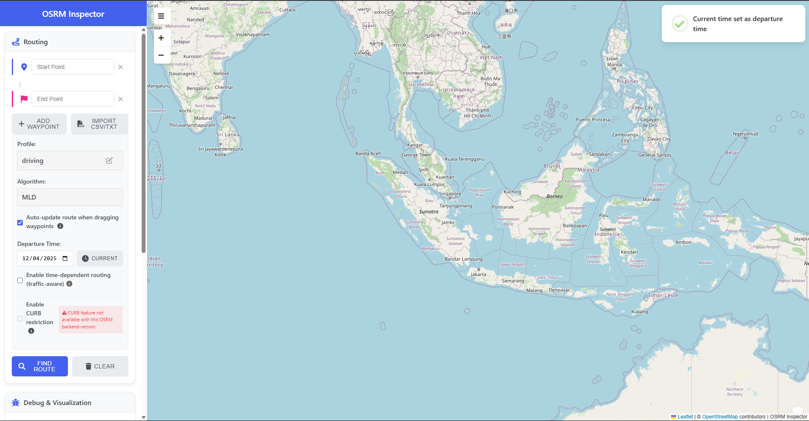
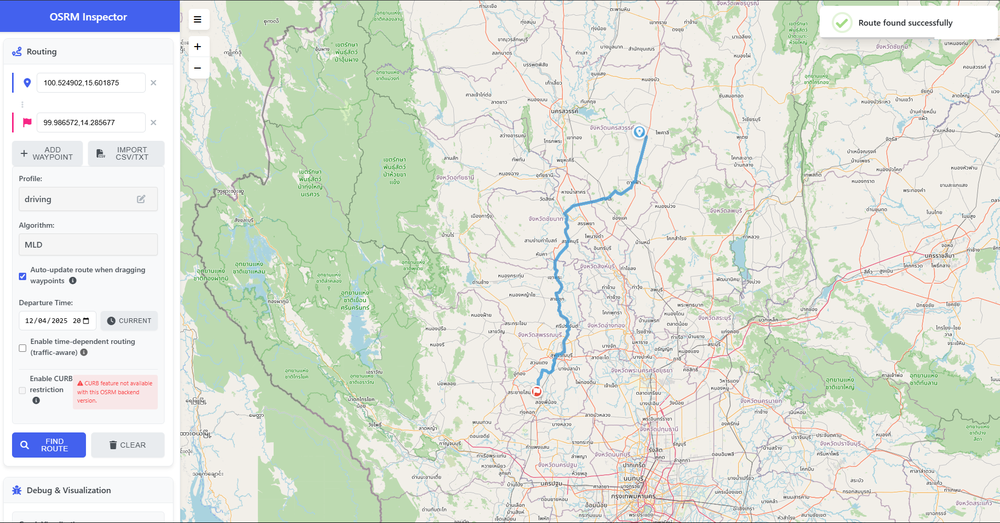
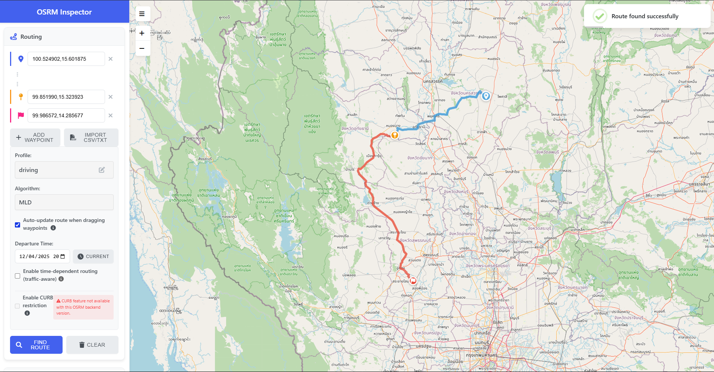
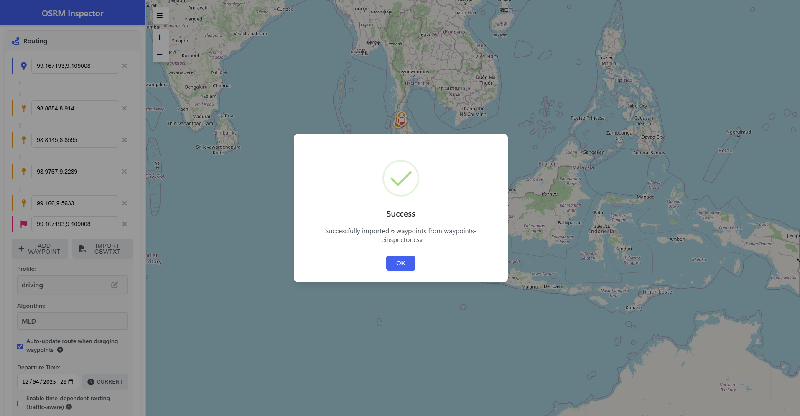
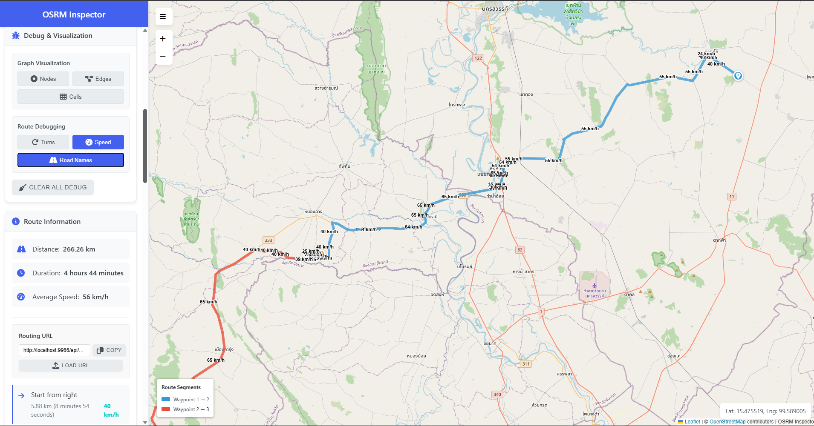
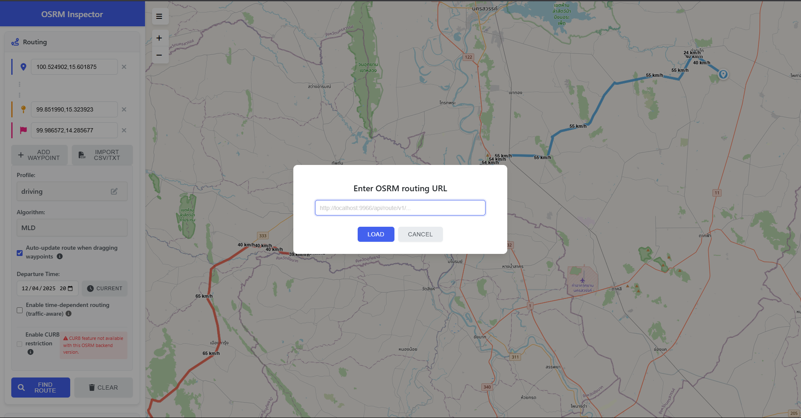

# OSRM Frontend

[](https://opensource.org/licenses/MIT)

OSRM Frontend is a modern frontend application for examining, testing, and visualizing routes generated by the [OSRM (Open Source Routing Machine)](http://project-osrm.org/). The application provides an intuitive and feature-rich interface for users who want to interact with OSRM services.



## 🌟 Key Features

- **Flexible Route Finding**: Support for multiple waypoints with drag-and-drop functionality
- **Multiple Profiles**: Support for various routing profiles (driving, walking, cycling, truck, etc.)
- **Debug Visualization**: Display nodes, edges, cells, turns, speed, and road names
- **Detailed Route Info**: Display distance, duration, turn-by-turn instructions, and average speed
- **Import/Export**: Import waypoints from CSV files and copy/paste routing URLs
- **Modern UI**: Responsive and intuitive user interface with a modern blue theme

## 📝 Usage Guide

### Basics

1. **Finding a Route**:

   - Click on the map to set a starting point (or enter coordinates in the "Start Point" input)
   - Click again to set an end point (or enter coordinates in the "End Point" input)
   - Click the "Find Route" button to generate the route
     

2. **Adding Additional Waypoints**:

   - Click the "Add Waypoint" button to add a new waypoint
   - Click on the map to set the waypoint position (or enter coordinates manually)
     

3. **Working with Profiles**:
   - Select a routing profile (car, bike, foot, etc.) from the dropdown
   - For custom profiles, click the edit icon and enter the profile name

### Advanced Features

1. **Importing Waypoints**:

   - Click the "Import CSV/TXT" button
   - Select a file with format: (latitude,longitude) or (longitude,latitude)
     

2. **Debug Visualization**:

   - Use the "Debug & Visualization" panel to display road network elements:
     - Nodes: Display network nodes
     - Edges: Display edges/roads
     - Cells: Display partition cells
     - Turns: Display turn instructions
     - Speed: Display speed information
     - Road Names: Display road names
       

3. **Copy/Load Routing URL**:
   - After a route is generated, the routing URL will be displayed in the "Route Information" panel
   - Use the "Copy" button to copy the URL
   - The "Load URL" button allows loading a route from an OSRM URL
     

## 🧩 Code Structure

```
myosrm-frontend/
├── app.js                 # Application entry point
├── config.js              # Application configuration
├── debug.js               # Debug visualization
├── index.html             # Main HTML structure
├── map.js                 # Map management and visual layers
├── routing.js             # Routing functions
├── styles.css             # CSS stylesheet
├── sweetalert-helpers.js  # UI dialog helpers
└── utils.js               # Common utility functions
```

## 🔧 Configuration Options

Here are some of the main configuration options that can be customized:

| Option             | Description                             | Default Value                 |
| ------------------ | --------------------------------------- | ----------------------------- |
| osrmBackendUrl     | URL for the OSRM backend                | "/api"                        |
| map.center         | Initial map center [lng, lat]           | [-0.084039, 106.7709673]      |
| map.zoom           | Initial map zoom level                  | 5                             |
| routing.colors     | Colors for routes based on profile      | Object with color definitions |
| routing.lineWeight | Route line thickness                    | 6                             |
| debug.maxNodes     | Maximum number of debug nodes displayed | 1000                          |

## 🔍 Troubleshooting

### "No Route Found" Error

- Ensure your OSRM backend is running and accessible
- Check if your start and end points are within the coverage of the map data loaded into OSRM
- Try a different routing profile (e.g., from "driving" to "car")

### Debug Visualization Issues

- Debug features require an OSRM backend with supported endpoints
- Some visualizations may not be available depending on the OSRM version and compatibility

### Container Cannot Connect to OSRM Backend

- Make sure the backend URL is correctly configured in the environment variables or config.js
- If running both containers on the same host, use the Docker container name or Docker network IP for connection

## 🚀 Getting Started with Docker

### Prerequisites

- [Docker](https://www.docker.com/get-started) installed on your system
- Access to a running OSRM backend (local or remote)

### Setting Up the OSRM Backend with Docker

Before running OSRM Frontend, you need an OSRM backend. Here are the basic steps to run one with Docker:

```bash
# Download sample map data (Indonesia)
mkdir -p osrm-data
cd osrm-data
wget https://download.geofabrik.de/asia/indonesia-latest.osm.pbf

# Set up OSRM backend with car profile
docker run -t -v "${PWD}:/data" osrm/osrm-backend osrm-extract -p /opt/car.lua /data/indonesia-latest.osm.pbf
docker run -t -v "${PWD}:/data" osrm/osrm-backend osrm-partition /data/indonesia-latest.osrm
docker run -t -v "${PWD}:/data" osrm/osrm-backend osrm-customize /data/indonesia-latest.osrm

# Run the OSRM server
docker run -d -p 5000:5000 -v "${PWD}:/data" --name osrm-backend osrm/osrm-backend osrm-routed --algorithm mld /data/indonesia-latest.osrm
```

### Running OSRM Frontend with Docker

#### Using Pre-built Image

```bash
# Pull the latest image
docker pull dhanyyudi/myosrm-frontend:latest

# Run the container
docker run -d -p 9966:80 --name myosrm-frontend dhanyyudi/myosrm-frontend:latest
```

#### Building and Running from Source

```bash
# Clone the repository
git clone https://github.com/dhanyyudi/myosrm-frontend.git
cd myosrm-frontend

# Build the Docker image
docker build -t myosrm-frontend .

# Run the container
docker run -d -p 9966:80 --name myosrm-frontend myosrm-frontend
```

### Configuration

To connect OSRM Frontend to your OSRM backend, you can use one of the following methods:

#### Using Environment Variables

```bash
docker run -d -p 9966:80 \
  -e OSRM_BACKEND_URL=http://your-osrm-host:5000 \
  --name myosrm-frontend myosrm-frontend
```

#### Using Configuration File

1. Create a custom `config.js` file:

```javascript
const CONFIG = {
  osrmBackendUrl: "http://your-osrm-host:5000",
  map: {
    center: [-0.084039, 106.7709673],
    zoom: 5,
  },
  // other configurations...
};
```

2. Run with mounted volume:

```bash
docker run -d -p 9966:80 \
  -v /path/to/your/config.js:/usr/share/nginx/html/config.js \
  --name myosrm-frontend myosrm-frontend
```

#### Using Docker Compose

Docker Compose provides an easier way to manage both the OSRM backend and the OSRM Frontend frontend together.

1. Create a `docker-compose.yml` file:

```yaml
version: "3"

services:
  osrm-backend:
    image: osrm/osrm-backend
    container_name: osrm-backend
    volumes:
      - ./osrm-data:/data
    ports:
      - "5000:5000"
    command: osrm-routed --algorithm mld /data/indonesia-latest.osrm
    restart: unless-stopped

  myosrm-frontend:
    image: dhanyyudi/myosrm-frontend:latest
    container_name: myosrm-frontend
    volumes:
      - ./config.js:/usr/share/nginx/html/config.js
      - ./nginx.conf:/etc/nginx/conf.d/default.conf
    ports:
      - "9966:80"
    environment:
      - OSRM_BACKEND_URL=http://osrm-backend:5000
    depends_on:
      - osrm-backend
    restart: unless-stopped
```

2. Create a custom Nginx configuration (`nginx.conf`):

```nginx
server {
    listen 80;
    server_name localhost;
    root /usr/share/nginx/html;
    index index.html;

    # Enable gzip compression
    gzip on;
    gzip_types text/plain text/css application/javascript application/json;

    # Cache static files
    location ~* \.(js|css|png|jpg|jpeg|gif|ico)$ {
        expires 30d;
        add_header Cache-Control "public, no-transform";
    }

    # Proxy requests to OSRM backend
    location /api/ {
        proxy_pass http://osrm-backend:5000/;
        proxy_set_header Host $host;
        proxy_set_header X-Real-IP $remote_addr;
        proxy_set_header X-Forwarded-For $proxy_add_x_forwarded_for;
        proxy_set_header X-Forwarded-Proto $scheme;
    }

    # Handle HTML files
    location / {
        try_files $uri $uri/ /index.html;
    }

    # Error handling
    error_page 500 502 503 504 /50x.html;
    location = /50x.html {
        root /usr/share/nginx/html;
    }
}
```

3. Start the services:

```bash
docker-compose up -d
```

This setup configures:

- An OSRM backend service for route calculations
- The OSRM Frontend frontend with Nginx
- Proper proxy configuration to allow the frontend to communicate with the backend
- Caching and compression for better performance

### Accessing the Application

After the container is running, open a web browser and navigate to:

```
http://localhost:9966
```

## 🤝 Contributing

Contributions are always welcome! Please open an issue or pull request if you'd like to help improve OSRM Frontend.

## 📄 License

Distributed under the MIT License. See `LICENSE` for more information.

## 📢 Acknowledgments

- [OSRM Project](http://project-osrm.org/) - Open Source Routing Machine
- [Leaflet](https://leafletjs.com/) - JavaScript library for interactive maps
- [SweetAlert2](https://sweetalert2.github.io/) - JavaScript library for beautiful dialogs
